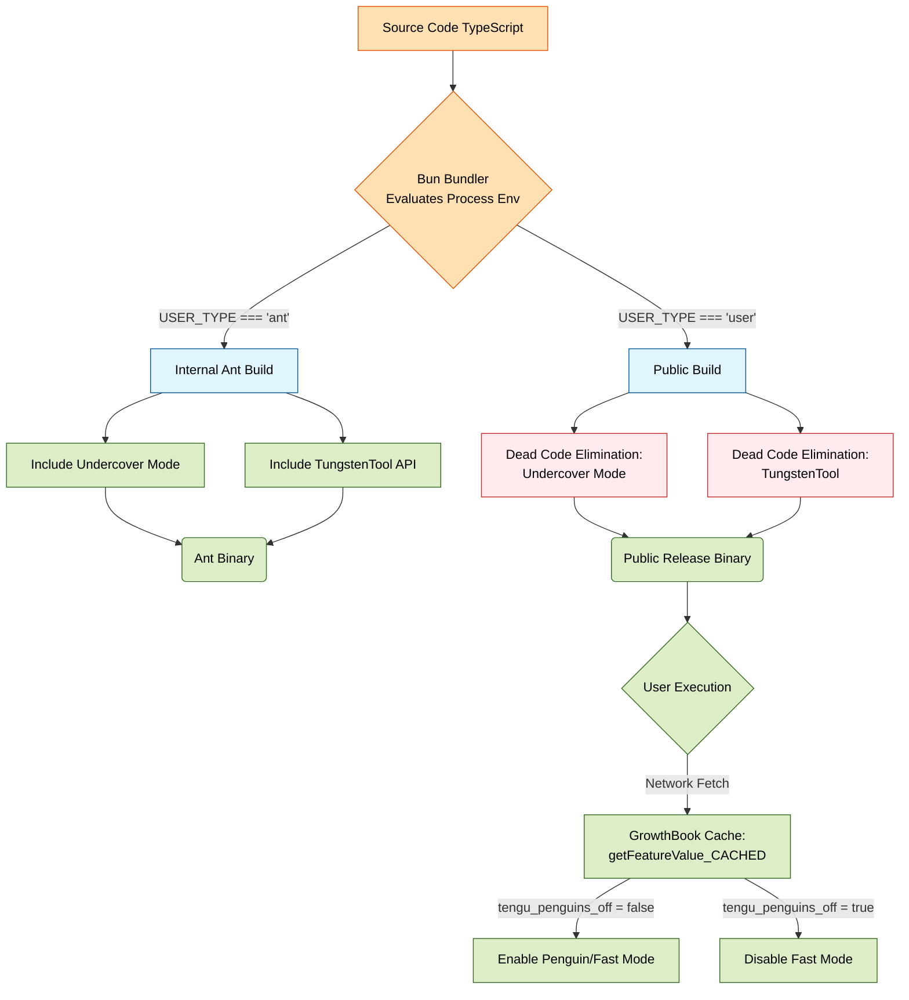
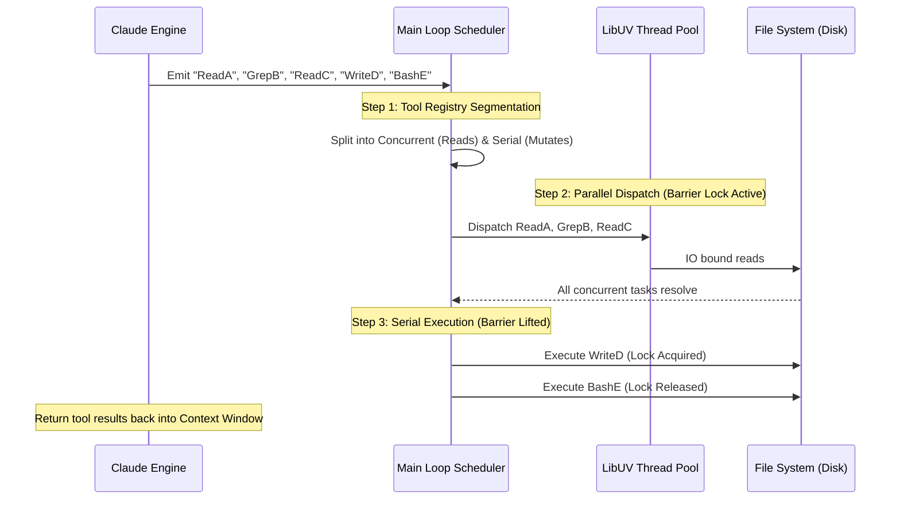
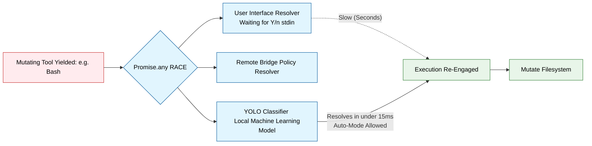

# Unpacking the Architecture of Claude Code: An Engineering Deep Dive

*March 31, 2026 | System Design & Architecture*

Claude Code is not a simple Read-Eval-Print Loop (REPL) interacting with an LLM. It is a highly concurrency-optimized swarm engine governed by strict compiler-level feature gating, asynchronous streaming barriers, and asynchronous state isolation.

Here is a proper architectural breakdown of how Claude Code is built under the hood.

---

## 1. The Compilation Pipeline & Feature Gating

Anthropic utilizes a strict compile-time feature elimination strategy rather than runtime branching to separate internal beta features from public shipping binaries. 

Built on top of Bun’s bundler, Claude Code relies on `bun:bundle`'s `feature()` primitives and environment variable substitution (e.g., `process.env.USER_TYPE`).

### Dead-Code Elimination (DCE)
Because branches checking for `USER_TYPE === 'ant'` are evaluated during the build process, the bundler constant-folds these conditional checks. If compiling for external distribution, entire directories handling corporate proxy configurations, the `TungstenTool`, or the `Undercover Mode` logic are forcefully dead-code eliminated from the final AST.

### GrowthBook for Runtime
While destructive structural features are compiled out, runtime A/B testing and non-destructive feature flags (e.g., `tengu_penguins_off` for Fast Mode) are resolved via GrowthBook. Using the `getFeatureValue_CACHED_MAY_BE_STALE()` function implies Anthropic strictly prioritizes non-blocking execution over exact configuration consistency on the hot path.

---

## 2. Multi-Agent Orchestration (Coordinator Mode)

The most structurally significant revelation is the `coordinatorMode.ts` implementation. Claude Code abstracts the LLM out of a 1:1 user interaction and into a **Swarm Coordinator**.

Anthropic utilizes exact-prefix caching to make parallelism effectively "free" in terms of tokens. When the Coordinator determines a feature requires modifying five files, it does not do this sequentially.

```mermaid
graph TD
    classDef manager fill:#ffe0b2,stroke:#e65100,stroke-width:2px,color:#000000;
    classDef worker fill:#e1f5fe,stroke:#01579b,stroke-width:2px,color:#000000;
    classDef mem fill:#f5f5f5,stroke:#424242,stroke-width:2px,stroke-dasharray: 5 5,color:#000000;

    UI["Local Terminal CLI"] -->|"Prompt"| Coord("Coordinator Node: Task Specifier")
    
    Coord -->|"Generates XML Payload"| Cache["Prompt Prefix Validation Cache"]
    Cache --> |"Cache Hit 99%"| W1("Worker 1: Read/Grepper")
    Cache --> |"Cache Hit 99%"| W2("Worker 2: Writer")
    Cache --> |"Cache Hit 99%"| W3("Worker 3: Linter")

    W1 & W2 & W3 <--> |"&#60;task-notification&#62; XML tags"| Lock[("Shared SQLite/Filesystem Lock <br/> tengu_scratch/")]
    
    Lock -.-> |"State Verification"| Coord
    Coord --> |"Final Diff"| UI

    class Coord manager;
    class W1,W2,W3 worker;
    class Lock mem;
```

1. **Isolation:** Context isolation is managed via `AsyncLocalStorage` (for in-process concurrency) or process-based isolation routing stdout through native `tmux` or `iTerm2` panes.
2. **Durability:** Workers communicate cross-process via a shared file-system lock in a directory named `tengu_scratch`.
3. **Interop:** State and findings are passed via strictly typed `<task-notification>` XML blocks, preventing JSON parse failures on malformed streaming outputs.

---

## 3. The Execution Loop & Barrier Syncing

Claude Code ships with a registry of over 60 discrete tools (`tools.ts`). Because the tool-calling architecture allows the LLM to yield multiple tool requests in a single generation tick, the execution pipeline must safely schedule them.

The architecture strictly partitions the registry:
* **Concurrent (Read-Only):** Globbing, Grepping, Reading Files, Fetching Webpages.
* **Serial (Mutations):** Bash execution, File Writes, File Edits.

The Execution Loop aggregates the emitted tool calls from the async generator, places the Concurrent tools onto the libuv thread pool in parallel, and waits at a **Barrier Sync**. Once all reads resolve, the Serial tools execute synchronously via a locking queue to guarantee zero race conditions on your codebase.

---

## 4. Security: The YOLO Classifier & Memory Dump Prevention

Traditional CLIs block entirely on `stdin` for user confirmation. Claude Code converts authorization into an asynchronous, parallel race condition to completely eliminate I/O blocking from the critical path.

### The YOLO Classifier Race
When a mutating tool yields, three resolvers fire simultaneously: (1) `User Interface Resolver`, (2) `Bridge Resolver`, and (3) the `YOLO Classifier`.
If the user has `Auto Mode` enabled, the YOLO classifier evaluates the current transcript chunk in under 15ms, verifies the LLM isn't attempting a supply-chain attack (e.g., `rm -rf ~/.ssh`), and auto-yields the Promise back to the Execution Loop.

### The Upstream Proxy Daemon: Memory Hardening
For API traffic, Claude Code spins up an isolated background process (`upstreamproxy/`). To prevent hostile execution environments (e.g., untrusted workspaces downloaded from Github) from attaching to the process and sniffing API keys or session tokens from memory, the daemon executes `prctl(PR_SET_DUMPABLE, 0)` on Linux, outright denying `ptrace` attachments or core-dump extractions from processes under the same UID.

---

## Conclusion

Claude Code is a masterclass in treating an LLM as a non-deterministic CPU that requires deterministic memory constraints, strict lifecycle hooks, and asynchronous state synchronization. 

By abstracting tool execution behind barrier syncs, offloading planning to parallel background workers, and aggressively partitioning the prompt context to optimize API cache behavior, Anthropic has laid the definitive blueprint for modern Agentic Software Engineering.
