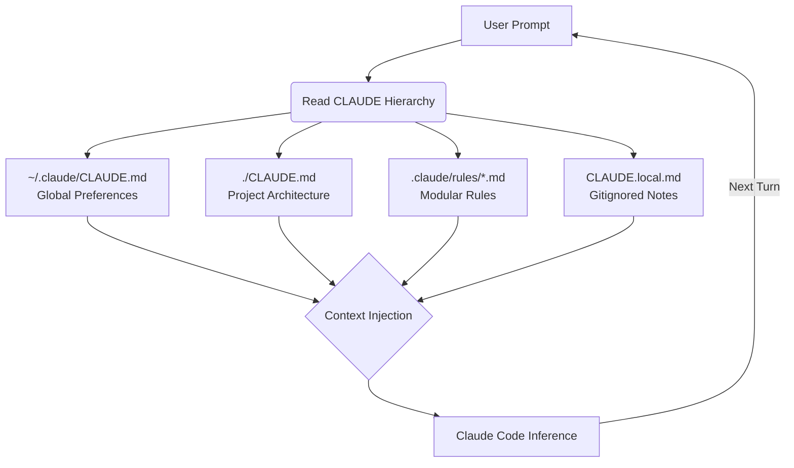
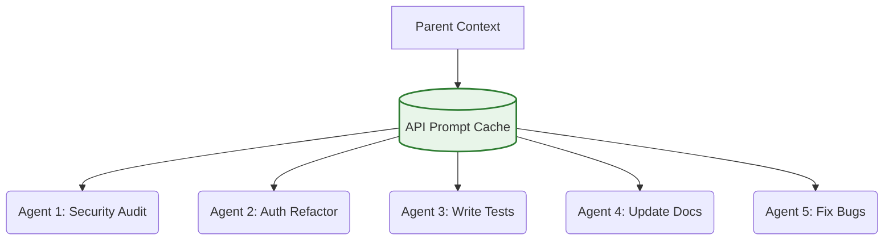
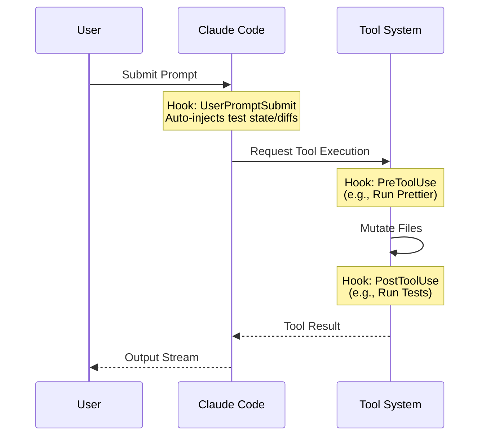
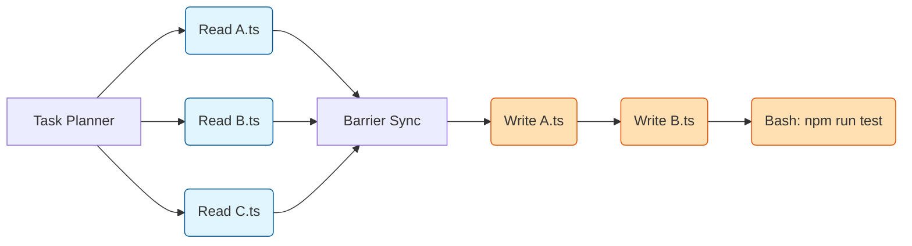

# How to Get 10x Out of Claude Code

An architectural breakdown of Claude Code, revealing how to use it as the agent orchestration platform it truly is, rather than just a terminal chatbot.

---

## 1. The `CLAUDE.md` Hierarchy (Loaded Every Turn)

The most critical architectural detail is that Claude Code reads your `CLAUDE.md` files **on every single query iteration**, not just at session start. Most users either leave these blank or treat them with minimal context.

You are given a **40,000 character allowance**. Use it for architecture decisions, conventions, and anti-patterns. 

### The Context Cascade


---

## 2. Parallel Subagents & Prompt Caching

When Claude Code forks a subagent, it creates a byte-identical copy of the parent context. This means **spawning 5 agents to do parallel work costs virtually the same as 1 agent doing it sequentially** because they all hit the API prompt cache.

### Execution Models for Subagents
1. **Fork**: Inherits parent context; heavily cache-optimized.
2. **Teammate**: Opens in a separate Tmux/iTerm pane, using a file-based mailbox to communicate.
3. **Worktree**: Gets its own Git worktree with an isolated branch per agent.



---

## 3. The Auto-Permission System

Every time you click "allow" when Claude Code prompts for permission, that's a failure of configuration. Configure your `~/.claude/settings.json` once to eliminate this bottleneck.

**Resolver Race**: Claude Code races user clicks, an LLM classifier hook, and bridge validations in parallel. The first to respond wins. Set to **Auto mode** to utilize the LLM classifier for safety without the manual click fatigue.

```json
{
  "permissions": {
    "allow": [
      "Bash(npm *)",
      "Bash(git *)", 
      "Edit(src/**)",
      "Write(src/**)"
    ]
  }
}
```

---

## 4. Context Overflow & Compaction Strategies

Claude Code natively understands that context pressure is a core problem and institutes five compaction strategies. You're working within a 200K token window (or 1M if using the `[1m]` model suffix).

1. **Microcompact**: Fast dropping of old tool results.
2. **Context Collapse**: Summarizing intermediate conversational spans.
3. **Session Memory**: Extracting structured constraints and file mappings to a memory file.
4. **Full Compact**: Summarizing the entire history.
5. **PTL Truncation**: Dropping the oldest message blocks.

**Pro-Tip:** Don't wait for auto-compaction. Use `/compact` proactively like a quicksave in a video game to preserve the essential state and drop the noise.

---

## 5. The Hook Extension API (25+ Lifecycle Events)

Claude Code features a massive lifecycle hook system that allows for a fully custom developer environment.

- **Types of Hooks:** Shell command, LLM prompt, Agent verification loop, HTTP webhook, JS function.
- **Key Event:** `UserPromptSubmit` allows you to automatically inject `additionalContext` (like recent Git diffs or test logs) into every single message before the model sees it.



---

## 6. Smart Tool Batching & MCP Deferred Loading

Claude Code has over 60 integrated tools that are executed using an intelligent batching mechanism:
- **Concurrent (Read-only)**: Globbing and reading files happen in parallel.
- **Serial (Mutations)**: Writing to files or running bash scripts happen sequentially to avoid race conditions.



Furthermore, by utilizing **MCP Servers**, you can extend capabilities to databases and cloud providers. Due to **deferred loading**, connecting numerous instances incurs zero latency overhead until a tool is explicitly called.

---

## 7. Session Persistence

Stop running `claude` fresh! Closing a session is like closing your IDE and losing your local history, unsaved buffers, and terminal scrollback.

- Use `--continue` to resume the last session.
- Use `--resume` to pick a past session from `.claude/projects/`.
- Use `--fork-session` to split off an alternate reality from a prior execution point.

Claude Code writes all states to `.jsonl`. Continued sessions benefit from **Session Memory**, carrying over previous task constraints, file hierarchies, and learnings.

---

## 8. Clean Streaming Interruptions & Resiliency

- **Interrupt Freely:** The pipeline uses async generators. Hitting `Escape` cleanly aborts the current response yielding while preserving all previous context. Don't wait for it to finish a wrong path.
- **Infinite Retries:** The engine has exponential backoff, auto OAuth token refresh, model fallback logic (from Opus to Sonnet if 529 errors occur), and a 90-second idle watchdog. It's built to run unattended without crashing.
