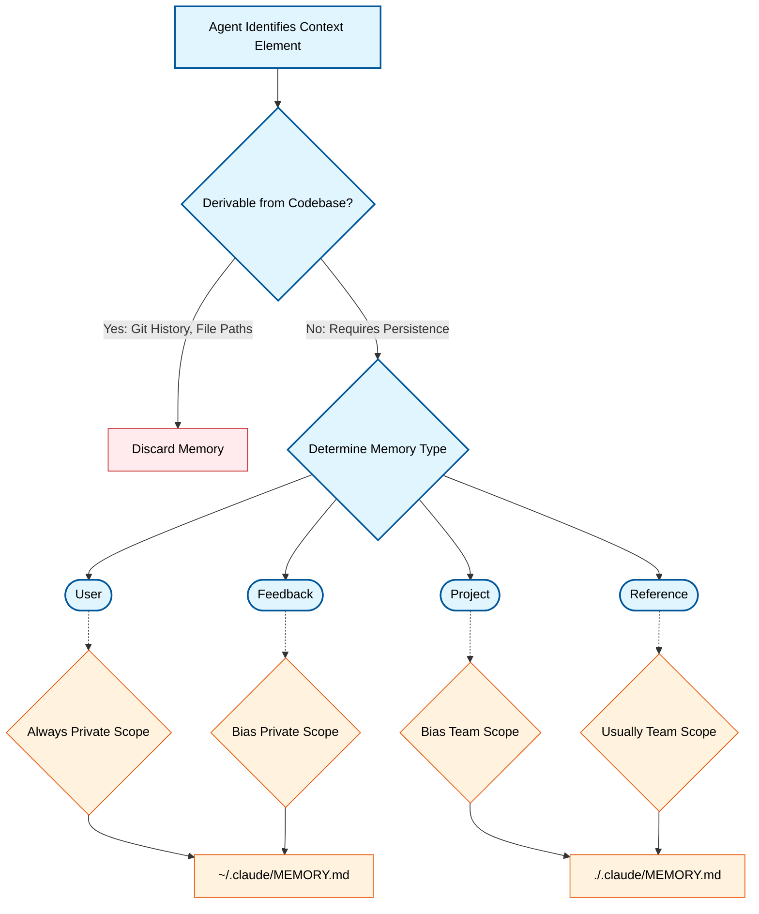
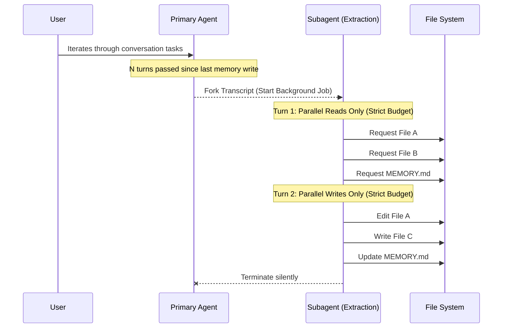
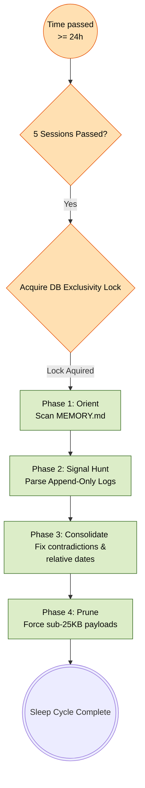
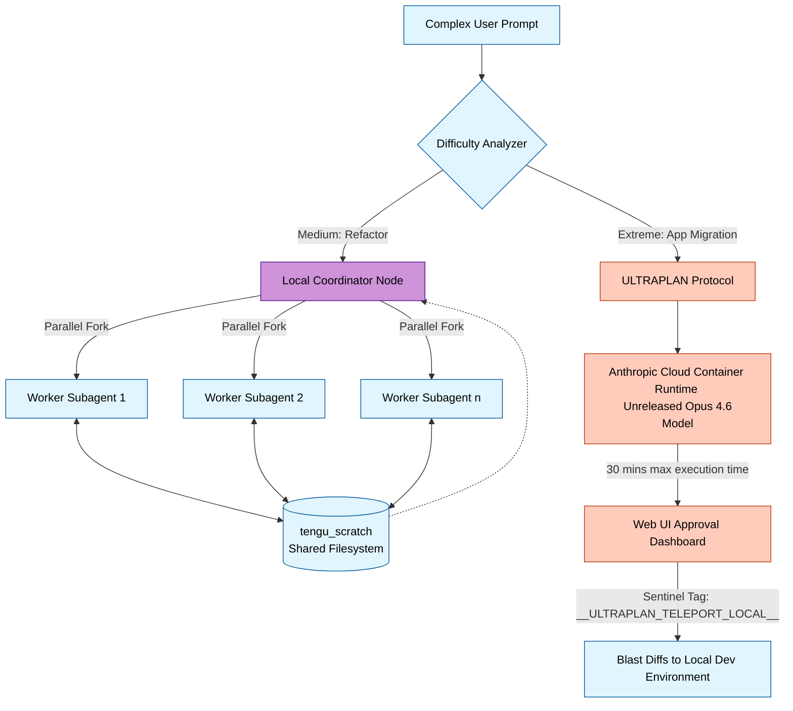

# The Memory & Reasoning Architecture of Claude Code

*March 31, 2026 | System Architecture & State Management*

One of the hardest problems in agentic software engineering is context persistence. How do you ensure an autonomous coding agent remembers technical constraints and user preferences across thousands of sessions without constantly polluting (and overflowing) its token context window? 

The leaked `.map` source code from Anthropic's Claude Code reveals a masterclass in autonomous memory allocation and cognitive reasoning loops. It separates transient "thinking" from durable "memory", backed by parallel background validation agents.

Here is exactly how Claude Code's memory and reasoning architecture actually works.

---

## 1. The Four-Tier Memory Taxonomy

If you dive into `memdir/memoryTypes.ts`, you’ll see that Claude Code strictly limits what it remembers to exactly four rigorously defined types. The prompt explicitly instructs the LLM *not* to save architecture, file paths, or git history—because these can be dynamically derived via `git log`/`grep` at runtime.

Memory is highly curated into four classes, further separated by **Private** vs **Team** scopes:

1. **`user` (Always Private):** Tracks domain knowledge levels. (*e.g., "User is a data scientist, frame frontend concepts using backend analogies."*)
2. **`feedback` (Bias Private):** Tracks behavioral corrections and confirmations. The prompt specifically instructs Claude to record *confirmations of success* so that it doesn't "grow overly cautious" from only remembering negative corrections.
3. **`project` (Bias Team):** Tracks organizational contexts. (*e.g., "Merge freeze begins on 2026-03-05 for mobile release cut."*) The prompt strictly forces Claude to **convert relative dates ("next Thursday") to absolute dates** to prevent temporal drift.
4. **`reference` (Always Team):** Pointers to external systems. (*e.g., "Pipeline bugs are tracked in Linear under project INGEST."*)

### Formatting and Constraints
Memories are stored in `.md` files with Markdown frontmatter (name, description, type).
To prevent prompt-context explosion during normal sessions, the `MEMORY.md` index file is strictly regulated:
* Each entry must be exactly one line.
* Max length is ~150 characters.
* Hard-truncated at **200 lines** to save tokens.

---

## 2. Background Extraction Agents & Turn Budgets

Claude doesn't force the primary chat agent to manually handle filesystem memory mutations on the hot path (which would slow down the user's chat speed). 

Instead, checking `services/extractMemories/prompts.ts` reveals a dedicated **Memory Extraction Subagent**.

Every few turns, Claude Code forks the conversation and spawns a background agent with a severely restricted toolset (only `FileRead`, `FileEdit`, and read-only `Bash` commands like `ls`/`stat`). 
Because agents generate expensive reasoning steps, this subagent is forced onto a strict **Turn Budget**:

---

## 3. The `autoDream` Consolidation Loop (Memory GC)

Memory rots over time as codebases evolve. Anthropic mitigates "stale memory hallucination" using a Garbage Collection subagent called **autoDream**.

Triggered transparently under a Three-Gate Lock (24-hour expiration, 5 active sessions tracked, DB exclusivity), the algorithm executes a four-phase memory scrub. 

To further safeguard against hallucinations, the prompt compiler injects a **`MEMORY_DRIFT_CAVEAT`**:
> *"Memory records can become stale over time... Before answering the user... verify that the memory is still correct and up-to-date by reading the current state of the files."*

---

## 4. Multi-Agent Reasoning & ULTRAPLAN

Claude Code's cognitive load isn't restricted to a single monolithic API call. It implements varying levels of computational effort depending on the task's complexity.

### Coordinator Mode Swarms
For complex refactoring, reasoning is explicitly decentralized. A **Coordinator** acts as the high-level system architect. It evaluates the prompt, draws up a spec layout, and parallelizes the actual coding tasks out to localized **Worker Agents**. 

These isolated workers execute tasks and write their outputs to a shared SQLite/Filesystem lock directory (`tengu_scratch`). The Coordinator then reads the scratchpad outputs to cross-verify that the implementation matches the original spec.

### ULTRAPLAN (The Heavy Compute Override)
For reasoning tasks that demand immense depth (e.g., full app migrations), the local Swarm is insufficient. 
Claude Code detects high-complexity tasks and bridges out to **ULTRAPLAN**. It fires a serialized task state payload to Anthropic's remote Cloud Container Runtimes (CCR). 

The CCR spins for up to 30 minutes, reasoning through deep multi-step trees, while the user watches a telemetry dashboard in their local browser. Upon user approval, the compiled architecture payload is "teleported" back into the CLI via a sentinel XML tag, converting 30 minutes of cloud-based reasoning directly into local filesystem diffs.

---

## Summary

Anthropic's approach to Agentic Memory is defined by paranoid prompt constraints and decoupled background validation. By limiting the primary loop's context window to a strictly pruned, 200-line index flag—and offloading the actual IO mutations to `autoDream` cycles and parallel Extraction Subagents—Claude Code manages to remember the user's intent indefinitely without ever suffocating its own context window.
