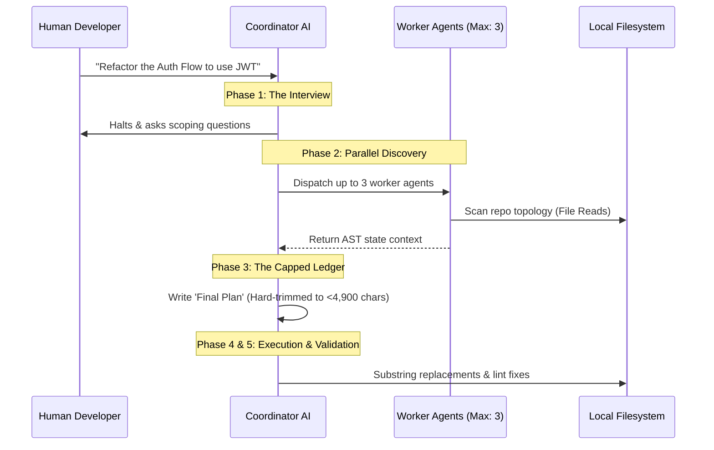
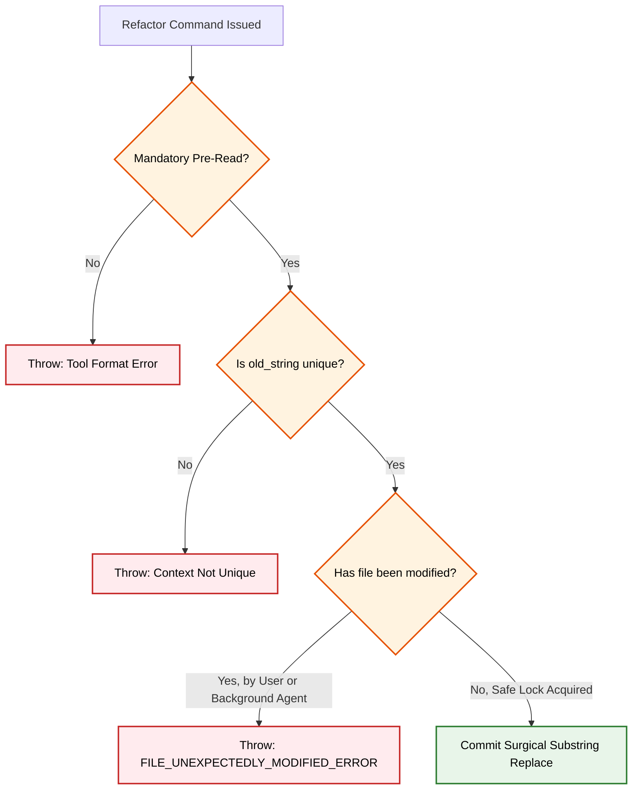

# How Claude Code Actually Executes Massive Refactors

*March 31st 2026 | System Design & AI Execution Loops*

Ask a standard LLM chatbot to rewrite your entire authentication flow, and it will likely hallucinate halfway through the codebase or output an un-mergeable block of gibberish.

The challenge of autonomous AI coding isn't generating code—it's maintaining a coherent train of thought across dozens of state-changing files without succumbing to context rot. 

Thanks to the accidental `.map` source code leak of the `claude-code` CLI, we finally know exactly how Anthropic solved the mass-refactoring problem. They built a heavy, multi-agent guardrail system driven by two core engines: **Plan Mode V2** and the **Sequential Edit Lock**.

Here is the precise mechanical breakdown of how Claude handles refactoring at scale.

---

## 1. The 5-Phase Plan Engine (`PlanModeV2`)

For complex architectural changes, Claude does not simply jump straight into the filesystem. It transitions into a heavy reasoning mode called `PlanModeV2`, which is governed by a strict 5-phase execution loop.

### The Interview Phase & Parallel Scanning
Before writing a single line of logic, the CLI checks `isPlanModeInterviewPhaseEnabled`. If triggered, the AI physically halts its execution loop and rapid-fires clarifying questions at you to finalize scope boundaries. 

Interestingly, if you are an Enterprise or "Max" tier user, the software actually permits the Coordinator to spin up **3 parallel exploration agents** (`getPlanModeV2AgentCount`) simultaneously. These nodes aggressively scan your repository's state before unifying their findings into a single specification ledger.

---

## 2. The Final Plan Length Vulnerability

This is perhaps the most fascinating piece of internal telemetry found inside the leak. Why do LLMs randomly go completely off-the-rails during deep coding tasks? Memory exhaustion.

Inside `utils/planModeV2.ts`, Anthropic engineers left their raw A/B testing data concerning the "Final Plan" document the AI writes for itself:

> *"Baseline (control, 14d ending 2026-03-02, N=26.3M): p50 4,906 chars | Reject rate monotonic with size: **20% at <2K → 50% at 20K+***"

This data proves that if an LLM is allowed to write an instruction ledger larger than 20,000 characters, it suffers a catastrophic **50% failure rate**, completely forgetting the initial prompt or failing to execute the tools. 

To prevent this hallucination collapse, Anthropic instituted a strict `tengu_pewter_ledger` system with progressive `trim`, `cut`, and `cap` arms, forcefully forcing the AI to harshly truncate its own refactoring plans to stay squarely under roughly 4,900 characters.

---

## 3. The `FileEditTool` Safeties

Once the refactoring specification is trimmed and finalized, the Workers begin pushing the edits. But rewriting entire 1,500-line files is incredibly error-prone and token-expensive. 

Instead, Claude uses a surgical `FileEditTool` that enforces exact substring replacements (`old_string` mapped to `new_string`).

To prevent race conditions or massive syntax breakages from concurrent agents, the tool establishes two major hard-locks:

1. **Mandatory Pre-Reads:** The prompt explicitly instructs: *"This tool will error if you attempt an edit without reading the file."* The LLM must lock the exact AST/Indentation state of the file before calculating the edit.
2. **Race Condition Prevention:** The CLI inherently tracks file modification hash-states. If you physically save the file, or a background extraction subagent touches the file while the primary Worker is calculating the edit, the CLI instantly throws a hard `FILE_UNEXPECTEDLY_MODIFIED_ERROR`. This forces the agent to read the file again, entirely preventing asynchronous git-merge-style code destruction.

### Summary
When you tell Claude Code to rewrite your application, you aren't just sending a prompt to a language model. You are initiating an explicit Interview Phase, spinning up 3 localized scanning agents, generating a highly-compressed 4.9k character strategy ledger to prevent hallucination, and executing mathematically-locked substring replacements guarded against race-conditions. 
